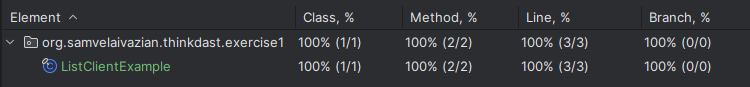

# Chapter 1: Interfaces

## Project Description

This module demonstrates the use of interfaces in Java as part of the ThinkDast series. 
The solutions provided are my personal implementations, 
incorporating clean code principles, best practices, and thorough testing.

## Problem Statement

In this exercise, the initial implementation of the `ListClientExample` class used a `LinkedList` to store elements. 
The task was to replace the `LinkedList` with an `ArrayList`. 
This involved modifying the constructor of the `ListClientExample` class 
to instantiate an `ArrayList` instead of a `LinkedList`.

### Original Implementation

```java
import java.util.LinkedList;
import java.util.List;

@SuppressWarnings("rawtypes")
public class ListClientExample {
    
    private List list;

    public ListClientExample() {
        list = new LinkedList();
    }

    private List getList() {
        return list;
    }

    public static void main(String[] args) {
        ListClientExample lce = new ListClientExample();
        List list = lce.getList();
        System.out.println(list);
    }
    
}
```

## Project Structure

The project is organized into the following structure:

- **Source Code**: Located in `src/main/java/org/samvelaivazian/thinkdast/exercise1`
- **Tests**: Located in `src/test/java/org/samvelaivazian/thinkdast/exercise1`

### Classes

- **ListClientExample**: A generic class that provides an example of a client that uses a list.
- **ListClientExampleTest**: JUnit test class for `ListClientExample`.

## Methods

### ListClientExample Class

1. **`ListClientExample()`**
    - **Description:** Initializes an empty list using an `ArrayList`.

2. **`List getList()`**
    - **Description:** Retrieves the list.

## Build and Test

### Building the Project

To build this module, navigate to the `chapter_1_interfaces` directory and run:

```bash
mvn clean install
```

### Running Tests

To run the tests and see the assertion results, use the following Maven command:

```bash
mvn test
```

### Test Coverage

All test cases pass successfully, and the code coverage is 100%, as shown in the screenshot below:



## Requirements

- Java 21
- Maven 4.0.0+
- JUnit 5.10.2

## Usage

### ListClientExample

A generic class that uses a list. The list is initialized as an `ArrayList` and can hold elements of type `T`.

#### Example Usage

```java
ListClientExample<Integer> listClientExample = new ListClientExample<>();
List<Integer> list = listClientExample.getList();
```

### ListClientExampleTest

JUnit tests for `ListClientExample` to ensure the list is correctly instantiated as an `ArrayList`.

#### Example Test

```java
@Test
public void testListClientExample() {
    final ListClientExample<Integer> listClientExample = new ListClientExample<>();
    final List<Integer> list = listClientExample.getList();

    Assertions.assertInstanceOf(ArrayList.class, list);
}
```

## License

This module is part of the ThinkDast project and is licensed under the MIT License — 
see the [LICENSE](../LICENSE) file for details.